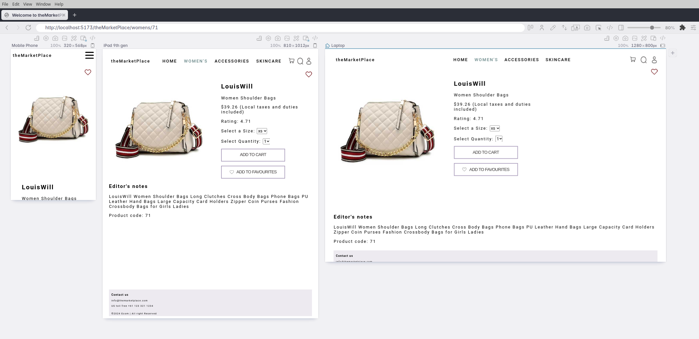

# Welcome to theMarketPlace

theMarketPlace is a React front-end backed by FireBase e-commerce application..

  

 

Explore it at: [portfolio.staceyfanner.com/theMarketPlace/](http://portfolio.staceyfanner.com/theMarketPlace/)

## About

theMarketPlace is a React front-end e-commerce application designed to provide users with an immersive shopping experience for luxury fashion items. Leveraging React and FireBase, it offers a seamless interface for browsing products.

## Planning Artifacts

1. Figma board: [board](https://www.figma.com/file/it0HP8sbGr3JPLmASUos2s/theMarketPlace---ecom?type=design&node-id=1-2&mode=design&t=P6UBNRnVQDfHI7Jo-0)

  

 

## Key Features:

1. **Product Carousel:** Provides an interactive way to create awareness for new products while increasing user engagement and time spent on site.
2. **Category Page:** Display a grid of products populated via FireBase.
3. **Product Page:** Provides additional details of a selected product including the ability to add as a favorite and add to cart.

## Key Learning Highlights

1. **useReducer**: Exploring this as an alternative to useState given I had several methods which affected state.
2. **useContext**: Helped me streamline the way data is passed down through the component tree.
3. **Seeding data via dummyJson API**: Working with the admin SDK for FireBase to populate my db with products.

<!-- 
## Challenges

1. **Dialog element**: Issues with rendering and understanding that adding a display property to the dialog itself would negate the close() method which meant that the dialog effectively would not "close".
2. **CSS Positioning**: Working across Grid and Flexbox to get the best of each.
3. **Responsive Design**: Trying to manage how the app would be experienced across a range of device sizes - using Polypane to guide my choices to help shape a responsive experience.  -->

## To-Dos

1. **Cart Page**: Implement UX and logic to complete the Cart functionality 

## Screenshots

| Home Page                                | Product Page                     |
| ---------------------------------------- | ------------------------------- |
|  |  |

## Technologies Used

