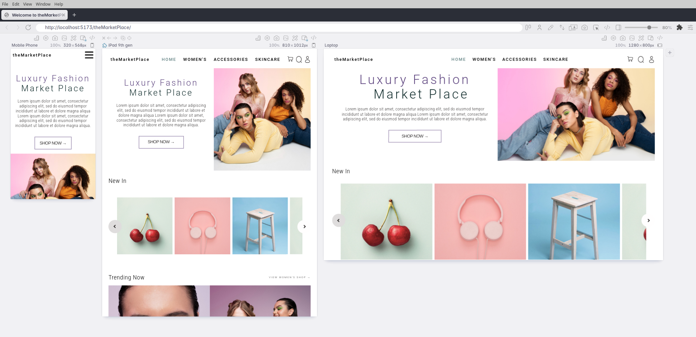

# Welcome to theBookVerse!

theBookVerse is a React front-end application that leverages the power of the Google Books API to provide users with an immersive experience in exploring a vast array of books.

  
  

 

Explore it at: [books.staceyfanner.com](https://portfolio.staceyfanner.com/theBookVerse/)

## About

theBookVerse is a comprehensive and intuitive books app designed to bring the world of literature to your fingertips. With theBookVerse, users can effortlessly explore an extensive library of books, discover new titles, and delve into detailed information about their favorite books.

## Planning Artifacts

1. Figma board: [board](https://www.figma.com/file/poyTLff8dMQd5bqgpUxUXs/theBookVerse?type=design&node-id=0%3A1&mode=design&t=q9huSLreRqj1BvCh-1)

  

 

## Key Features:

1. **Search Functionality:** Easily search for books by title, author, genre, or keyword to find exactly what you're looking for.
2. **Book Gallery:** Immerse yourself in a virtual gallery of books.
3. **Detailed Book Info:** Get access to comprehensive information about each book. Where available, there are links to Google Play to buy the book.

## Key Learning Highlights

1. **React**: Identifying a use case for useRef for the modal to utilize dialog's built-in methods to control the modal. Overall deepening my understanding of React and reusable module design.
2. **Google Books API**: Reading through documentation and working with Postman to wrangle the API.
3. **Figma**: Feeling more confident with Figma and experimenting with new features such as exporting assets directly from Figma designs to improve my design choices.

## Challenges

1. **Dialog element**: Issues with rendering and understanding that adding a display property to the dialog itself would negate the close() method which meant that the dialog effectively would not "close".
2. **CSS Positioning**: Working across Grid and Flexbox to get the best of each.
3. **Responsive Design**: Trying to manage how the app would be experienced across a range of device sizes - using Polypane to guide my choices to help shape a responsive experience.

## To-Dos

1. **Additional Functionality**: Explore ways to create a user reading list, utilizing the Bookshelf functionality of Google Books API.

## Screenshots

| Home Page                                | Modal View                      |
| ---------------------------------------- | ------------------------------- |
|  |  |

## Technologies Used

